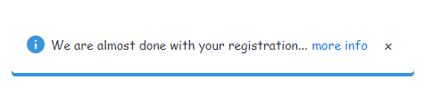

# streamlit-custom-notification-box
A custom notification box for streamlit with the ability to close it out

If you need a notification bar with the ability to redirect users to an external site (optional) and to pop up and be able to close it out, then give this a try. 
Its possible to change the colour, the image to correspond to the type of notification of your choice (warning, information, success etc). The image below is an example of information:

 

Its built on the [streamlit custom components typescript template](https://github.com/streamlit/component-template)

To install it:
```
pip install streamlit-custom-notification-box
```

**Variables**

- icon 
- textDisplay: Text to display
- externalLink: External link to send users to (optional)
- url: The url that users will be sent to
- styles: The optional CSS styling you want for the component
- key
- defaultIndex


```
st.subheader("Component with constant args")

styles = {'material-icons':{'color': 'red'}}

streamlit_custom_notification_box(icon='info', textDisplay='We are almost done with your registration...', externalLink='more info', url='#', styles=styles, key="foo")
```
